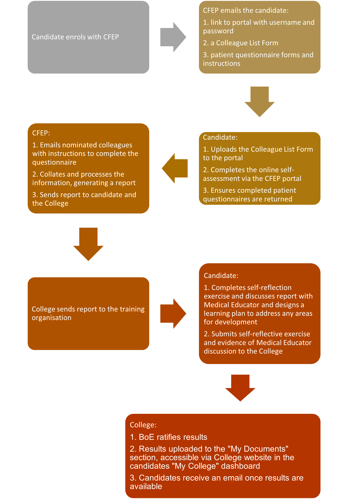

# Assessment Modalities

The assessment program requirements are documented in the [Training Program Requirements policy](https://www.acrrm.org.au/docs/default-source/all-files/training-program-requirements-policy.pdf?sfvrsn=ae2186e7_8) and the [Fellowship Training Program Handbook](https://www.acrrm.org.au/docs/default-source/all-files/handbook-fellowship-training.pdf?sfvrsn=bdb27590_26). The specific requirements and information for each of the training program assessment modalities are detailed in this handbook. 

The assessment modalities are:

* Mini-Clinical Evaluation Exercise (miniCEX)
* Multi-Source Feedback (MSF)
* Multiple-Choice Question assessment (MCQ)
* Case Based Discussion (CBD)
* Structured Assessment using Multiple Patient Scenarios (StAMPS)
* Logbooks
* Projects

## Mini Clinical Evaluation Exercise

### Introduction

The Mini-Clinical Evaluation Exercise (miniCEX) is a workplace based assessment used to evaluate a candidate’s clinical performance in real life clinical settings.

All candidates training on an ACRRM training program must complete formative MiniCEX assessments for CGT and when undertaking AST in a clinical discipline. Candidates must be in posts accredited by ACRRM for the corresponding stage of training or specific AST discipline. Formative miniCEXs are conducted progressively throughout training. 

In exceptional circumstances a candidate working towards Fellowship may be required to complete a summative miniCEX. This is determined by the College Censor-in-Chief (CIC).

The miniCEX training course for Clinicians - [online course](https://mycollege.acrrm.org.au/search/find-online-learning/details?id=19909&title=MiniCEX+training+course+for+clinicians) is designed for clinicians who are asked to conduct formative miniCEX assessments with ACRRM registrars.

### Requirements

***Core Generalist Training (CGT)***

Nine (9) miniCEX reviews must be submitted to obtain ‘satisfactory completion’ for formative assessment. However, there is no barrier to completing more than 9 MiniCEX if additional learning opportunities are available.

MiniCEX reviews are completed progressively during CGT, a plan of 3 per year of training would be appropriate to allow time for reflection on feedback and further clinical skill development. MiniCEX may include a combination of face-to-face and telehealth consults, but requirements cannot be met through telehealth consults only.  

Consults must include a:

* Range of types of consults, age groups and a mix of genders.
* Cover a minimum of five system focuses for the sonsultations:

  * cardiovascular
  * respiratory
  * abdominal
  * neurological
  * endocrine
  * musculoskeletal region
  * mental health
  * neonatal/paediatric
  * antenatal (first visit)
* Detailed history taking of at least one (1) new patient or detailed updating patient database information on a returning patient (of at least medium complexity).

The physical examinations are required to be undertaken only in the context of a face-to-face patient consultation.  A ‘[Physical Exam Reference](https://www.acrrm.org.au/resources/assessment/handbooks-guides)’ document is provided for guidance on undertaking a systematic physical assessment. 

A formative MiniCEX can be conducted within the context of the candidate’s medical educator visit or at any time at the instigation of the candidate or supervisor. The MiniCEX reviews are to be conducted by a doctor, meeting one of the following criteria: 

* FACRRM
* an ACRRM accredited supervisor

The assessor may be onsite viewing the consults face-to-face or offsite viewing the consults virtually. 

At a minimum three (3) different assessors are required to complete the nine (9) MiniCEX assessments. Three (3) of the MiniCEX assessments must be conducted by a Medical Educator from an ACRRM accredited training organisation (who does not work in the same workplace as the candidate).

***Advanced Specialised Training (AST)***

Candidates undertaking AST in Aboriginal and Torres Strait Islander Health, Adult Internal Medicine, Emergency Medicine, Mental Health, Paediatrics, Palliative Care, Remote Medicine and Surgery are required to have a formative MiniCEX conducted on a minimum of five (5) patient interactions (consults) during the AST component of their training.

The MiniCEX consults should be undertaken progressively during training and include a range of types of consults, age groups and mix of genders. The same principles apply around face-to-face and telehealth consults as described for CGT above.

A formative MiniCEX can be conducted at any time at the instigation of the candidate or supervisor. The MiniCEX assessments must be conducted by a doctor who is an ACRRM accredited supervisor or mentor for the post or holds a Fellowship of the Specialist discipline relevant to the AST.

### MiniCEX format

MiniCEX consists of the following:

* A short encounter between a candidate and patient which is observed by a supervisor. This encounter generally consists of the following components, a focused history taking focused clinical examination and assessment and takes approximately 15-20 minutes.
* Discussion of patient management and provision of oral and written feedback to the candidate by the supervisor to assist the candidate in planning for future patient encounters. This takes approximately 5-10 minutes.

The process is the same for summative MiniCEX except the assessment is undertaken by a College appointed assessor and candidates are not provided with feedback prior to ratification of results. 

There are five categories:

1. Communication skills
2. History taking
3. Physical examination
4. Clinical management
5. Professionalism
6. Overall clinical competence

For each consultation the proportion of each of these will vary but as many as possible should be assessed for each MiniCEX.

For each consultation, each category is assessed as:

* Beginning
* Progressing
* Achieved
* Exceeded 

Using the following domans:

1. Communication

   * Patient centered communication evident.  Built trust and rapport with patient.  
   * Showed empathy and respect. Asked patient for their story.  
   * Explored patient issue using a range of relevant question types.  
   * Considered and discussed the impact of presentation on patient function.   
   * Flexible in approach. Considered cultural values, attitudes and beliefs. 
   * Explained aspects of care clearly.  
   * Involved patient in decision making and provided appropriate advice.  
2. History taking 

   * Obtained a clinical history including presenting problems, epidemiology and cultural context. 
   * Questions focused and appropriate.  
3. Physical examination 

   * Sound assessment conducted and several key differentials considered.   
   * Relevant signs and symptoms covered. 
   * Assessment organised, logical and efficient.   
   * Patient comfort and safety considered. 
4. Clinical management 

   * An appropriate range of evidence gathered, and most plausible diagnosis provided to the patient. 
   * All required appropriate tests arranged. 
   * Short-term management and possible long-term management plan appropriate and discussed with patient. 
   * Follow-up arranged. 
   * Clearly addressed ethical / potential legal / work cover issues. 
5. Professionalism 

   * Ensured patient privacy and confidentiality.  
   * Demonstrated a commitment to teamwork, collaboration, coordination and continuity of care.  
   * Critically appraised own performance. 
   * Clinical documentation is in accordance with professional standards.  
   * Provided accurate and ethical certification for sickness, employment, social benefits and other purposes. 
6. Overall  

   * Overall approach systematic and consistently competent across marking categories.  
   * Made clear efforts to ensure patient comfort and safety and to reduce risks where appropriate.   
   * Communication skills effective. Patient involved in decision making. 
   * Diagnosis sound and based on information gathered.   
   * Appropriate history and assessment undertaken.  
   * Relevant further tests arranged to confirm diagnosis as required.   
   * Management appropriate and includes short and some long-term recommendations based on information gathered.   

More detailed descriptors for the competency standards for Fellowship- beginning/progressing/achieved are provided in the [Rural Generalist Curriculum](https://www.acrrm.org.au/resources/training/curriculum). 

For the purpose of fulfilling the mandatory requirements of the miniCEX, it is expected that the physical examination will be a thorough and complete assessment of the relevant system.  See [Physical Exam Reference](https://www.acrrm.org.au/resources/assessment/handbooks-guides) for guidance on the standard expected for physical assessment.

The MiniCEX form, patient consent proforma and Physical Exam Reference are available on the [Assessment Resources](https://www.acrrm.org.au/resources/assessment/forms) webpage.

### Roles and responsibilities

***Candidate***

The candidate is responsible for ensuring that they meet the mandatory requirements for MiniCEX. A candidate must ensure that completed MiniCEX forms are provided to the College.

***Assessor***

The assessor observes and scores consultation using ACRRM MiniCEX form. 
The assessor provides oral and written feedback to the candidate. 
The completed form is given to the candidate and a copy submitted to the College Training team via the supervisor.

## Multi-Source Feedback

### Introduction

The Multi-Source Feedback (MSF) is used widely in a range of professions.  The College includes MSF in the assessment program as a valid and reliable method of assessing interpersonal and professional behaviour, development and clinical skills. 

All candidates must complete the MSF assessment during core generalist training. The assessment must be undertaken in a post accredited by the College for CGT. MSF cannot be undertaken in a post that may be recognised for CGT but not accredited by the College, these include posts accredited by a Postgraduate Medical Council or other Specialist Medical Colleges.

### Requirements

Candidates are required to demonstrate ‘satisfactory completion’ of at least one (1) MSF. 

Satisfactory completion requires submission of:

* a completed MSF report covering the two (2) components
* a completed reflective exercise and
* evidence of discussion about the report results with a Medical Educator and 
* remediation if required.

The first three (3) components of the MSF process must have fulfilled within four (4) months from the date of enrolment in MSF.

The MSF assessment is not awarded a pass/fail standard, however if concerns are raised in any component of the MSF, the training organisation or College may require the candidate to repeat the MSF or undertake another type of assessment to gain further information or to determine if remediation has been effective. 

Once all the components of the MSF, including remediation if required, have been completed, the MSF outcome is presented to the BoE for ratification. The BoE determines ‘Satisfactory Completion’. 

The MSF must be conducted through Client Focused Evaluations Program (CFEP). The ACRRM version of the MSF is the preferred tool.  Alternate versions of MSF offered by CFEP are also acceptable. Both components of the tool must be completed; however, it is acceptable to undertake the Colleague Feedback Evaluation Tool (CFET) components and Doctors’ Interpersonal Skills Questionnaire DISQ separately. If completed separately a completed reflective exercise is required for each component. See the [CFEP website](https://www.cfepsurveys.com.au/acrrm-doctors) for further information.

### MSF format

The MSF tool consists of two (2) components:

1. A colleague assessment tool and a self-assessment tool; (collectively known as Colleague Feedback Evaluation Tool — CFET) and 
2. A patient assessment tool (Doctors Interpersonal Skills Questionnaire — DISQ).

   **Colleague tool**\
   The colleague tool involves a response from a minimum of 12 nominated colleagues, in order to obtain more complete data, 15 or more colleagues are preferred to participate. Colleagues are required to rate the candidate in 20 different areas.  There is also a provision for qualitative comments.

   **Self-assessment tool**\
   Completion of the self-assessment is a mandatory requirement for the MSF. 

   **Patient tool**\
   The patient tool involves a minimum of 30 patients participating in an anonymous questionnaire.  Patients are required to rate the candidate in 12 different areas. There is also a provision for qualitative comments.  

**MSF report**

A candidate ‘mean’ score for each question is provided. National means and performance bands have been calculated from data generated from previous ACRRM candidates.

See the [How to guide for reading ACRRM MSF reports](https://www.acrrm.org.au/resources/assessment/handbooks-guides). 

### Roles & Responsibilities

It is the candidate’s responsibility to: 

* Enrol and inform CFEP that they are undertaking MSF for as part of ACRRM training requirement. 
* Advise CFEP of the practice environment they will be working in whilst undertaking the MSF assessment.

  Candidates undertaking their MSF assessment in an environment where a significant proportion of the patients may have trouble in completing a questionnaire are able to ask an appropriate person. Candidates can also request CFEP to send an alternative DISQ patient survey for an Aboriginal Medical Service (AMS).

**Self-assessment tool**

* Candidates must submit a completed self-reflective exercise and evidence of discussion with Medical Educator to the College within two (2) months from the date the MSF report was received.
* In extenuating circumstances, an extension of time may be considered. The candidate must submit an [Application for Special Consideration ](https://www.acrrm.org.au/forms/application-for-special-consideration-in-acrrm-training)to the College, containing a written statement for the reasons for the requested extension. This must be submitted prior to the expiration of the deadline.
* If the deadline is exceeded without prior approval, the College reserves the right to report an ‘incomplete’ grade.  In this instance the candidate will be required to re-enrol, pay the MSF assessment fee and recommence the process.  

**Colleague tool** 

* Candidates must complete and return the colleague list providing names and email addresses of at least 15 colleagues. 
* A personal email address must be provided for each nominated colleague. Email addresses must be independently verifiable by CFEP.  Generic email addresses such as practicemanager@ or reception@ will not be accepted due to security reasons.

CFEP suggests nominating:

* **Five doctors**

  * three GP colleagues who are close to the candidate, e.g. neighbouring GPs, partners
  * two doctors from outside of the candidate’s immediate practice, e.g. consultant, candidates
* **Five Non-Medical Clinical Colleagues**

  * this should include a mix of people within a candidate’s practice and elsewhere, e.g. practice nurses, pharmacists, physiotherapists, midwives 
* **Five managerial or administrative staff**

  * this should include a mix of people within the candidate’s practice and from elsewhere, e.g. practice manager, reception staff, managerial staff of the local Primary Health Organisation.

**Patient tool**
The candidate is responsible for contracting a member of staff, e.g. a receptionist or an administrative officer to collect the completed patient questionnaires.  This must be a person who has an opportunity to see the candidate’s patients after consultations.  

The candidate is responsible for ensuring that the contracted person is provided with instructions to ensure this process is undertaken anonymously and in an ethical and professional manner, as follows:

* the candidate must hand the patient questionnaires with enough envelopes and staff guidelines to the contracted to the staff member for collection,
* the patient must not be advised of the questionnaire or invited to participate until after a consultation has been conducted,
* a confidential process must be adopted (a sealed box) for collecting completed questionnaires,
* patients should preferably complete the questionnaire whilst in the waiting room before they leave the premises,
* an envelope must be provided to each patient in which they must place their completed questionnaire,
* completed questionnaires must be handed back in a sealed envelope,
* if a patient insists on taking questionnaires away to complete, these must be returned the following day,
* under no circumstances should the candidate be given access to individual questionnaires,
* sealed questionnaires are not to be opened by anyone, and
* when a minimum of 30 questionnaires has been completed, these should be posted to CFEP in the large envelope provided.

CFEP will also provide instructions for this process when they send patient questionnaires to candidates.

### Summary of MSF process

Candidate enrols with CFEP

* CFEP emails the candidate:

  * a link to portal with username and password 
  * a Colleague List form
  * patient questionnaire forms and instructions 
* Candidate:

  * uploads the colleague list to the portal
  * completes the online self-assessment via the CFEP portal
  * ensures completed patient questionnaires are returned
* CFEP: 

  * emails nominated colleagues with instructions to complete the questionnaire. 
  * collates and process the information, generating a report
  * sends report to candidate and the College
* College:

  * send report to training organisation
* Candidate:

  * completes self-reflection exercise and discusses report with Medical Educator and designs a learning plan to address any areas for development
  * submits self-reflective exercise and evidence of Medical Educator discussion to the College
* College

  * BoE determines if MSF has been completed satisfactorily. 
  * Uploads results to the “My Documents” section, in a candidate “My College” dashboard, accessible from the College website. 
* Candidates receive an email once results are uploaded.

## Multiple Choice Question

### Introduction

The Multiple-Choice Question (MCQ) assessment assesses recall, reasoning and applied clinical knowledge. 

The MCQ assessment focuses on assessing the ability to manage medical care in a rural or remote environment. The assessment aims to cover all domains of rural and remote practise and is one of the summative assessments for CGT. 

### Requirements

Candidates are required to gain a pass in MCQ. The standard expected is that of a doctor practising at Fellowship level. 

Standard setting for the MCQ assessment is based on the modified Angoff method. This involves setting a standard score for test items prior to the test, using judgements by experts based on the projected performance of ‘borderline candidates.’ 

The pass mark for each assessment is calculated from the average Angoff score with consideration for an adjustment by the standard error of measurement and/or removal of questions that have not performed well. 

### MCQ format

The assessment is conducted over three hours and consists of 125 multiple-choice questions. The MCQ is conducted using a pencil-and-paper format. All candidates must complete the MCQ by completing an Answer Sheet of which is uploaded and marked automatically via the MCQ software. 

### Venue and Invigilators

All candidates undertake the MCQ on the same day and at the same time, regardless of their location. Candidates and invigilators will be notified of the assessment start time in Australian Eastern Standard Time. Each candidate and invigilator are advised to check their local time zone and adjust the start time to account for any differences, if necessary. 

For information relevant to venue and invigilator requirements refer to **Venues and Invigilators** section of this handbook.

### Questions

Questions mostly consist of a clinical case presentation, a brief targeted lead-in question and four options from which candidates are required to choose the single best option. The stem of the clinical case may include text and images. There are no negative marks for incorrect answers.  

Questions are designed to address specific components of the curriculum. Questions focus on topics and concepts that are either common or important to the everyday experience of independent and safe rural and remote doctors practising in Australia. Questions are researched and written by practising rural doctors using up-to-date Australian references. Assembled exams comprising 125 questions are reviewed by a panel of doctors.  

### Content

The assessment covers a balance of acute care cases, common and less common presentations, male and female patients, indigenous and non-indigenous patients, across all age groups. The assessment samples content from the curriculum domains and learning areas.   The approximate percentage of questions for learning areas appearing in an assessment is outlined in the table below.

\**The total of percentages is greater than 100% due to multiple domains being assessed multiple times within one assessment.*

### Preparation tools

**Introduction to MCQ Assessment**

The Introduction to MCQ Assessment [online course](https://mycollege.acrrm.org.au/search/find-online-learning/details?id=17222&title=Introduction+to+MCQ+Assessment) is available to candidates who enrol in the MCQ assessment to give insight into the MCQ assessment. It includes information relevant to the MCQ assessment such as what a MCQ assessment is, how questions are developed and provides an opportunity for candidates to develop MCQs.

**MCQ familiarisation activity (MCQFA)**

The MCQFA is available for candidates enrolled in a MCQ assessment. Candidates are advised by the Assessment team once the MCQFA is ready to be accessed. 

The MCQFA provides candidates the opportunity to become familiar with the format of questions used in an actual MCQ assessment.

Candidates can complete the activity over a number of hours; however, it is suggested that candidates try and complete the MCQFA under ‘summative assessment conditions’ i.e. over 144 minutes (1.44 minutes per question) and without accessing additional resources.

As with the actual MCQ assessment, MCQFA candidates are required to choose the single best answer for each question. One mark is awarded for each correct answer and there are no marks deducted for an incorrect answer. After candidates have completed all the questions and pressed the submit button, they immediately receive their overall score with the opportunity to review each question individually to see if answered correctly. Answer rationale and references are included for MCQFA review purposes.

The MCQFA can be attempted from any computer that meets the minimum technical specifications. There is no requirement for invigilation or supervision while candidates are online undertaking the MCQFA.

### Summary of MCQ process

* Candidates enrol in the MCQ during the advertised enrolment period 
* The College sends a confirmation of enrolment and eligibility, Examination Requirements and Assessment Venue Form
* Candidates return the Assessment Venue Form
* Candidates are advised of dates when the MCQFA can be accessed 
* The College provides a confirmation of assessment arrangements to invigilators and candidates

## Case Based Discussion

### Introduction

Case Based Discussion (CBD) is an assessment of clinical reasoning and application of knowledge in a clinical context. The candidate is required to demonstrate evidence of their clinical knowledge and how they apply that knowledge by appropriately assessing patients, formulating differential diagnoses, ordering relevant investigations and applying appropriate management plans.

CBD is one of the summative assessment requirements for CGT (Core Generalist Training) and for AST in Palliative Care.

CBD is designed to be undertaken in a health care facility providing continued care. The case notes must contain evidence that the candidate is the doctor primarily responsible for patient care.

Candidates may also complete CBD as a formative assessment. The format of this assessment remains consistent for both formative and summative assessment.

### Requirements

CBD assesses a total of six (6) cases. To pass the CBD assessment overall, candidates will need to achieve ‘at expected standard’ in five (5) of the six (6) cases. 

All three (3) sessions are conducted irrespective of the outcome of each individual session. Results of individual session are not advised.  The overall results are ratified by the Board of Examiners once all three CBD sessions are completed. Candidates who do not obtain a ‘pass’ grade will be required to enrol and complete the assessment process again.

***Core Generalist Training***

Candidates must submit twelve (12) cases at CBD enrolment covering a minimum of **six** (6) of the areas listed below. No more than three (3) cases can be from a single area. Two (2) **mental health** cases must be included in the submission to ensure that at least one (1) case is suitable for the assessment. 

* Aboriginal and Torres Strait Islander Health 
* Addictive Behaviours
* Adult Internal Medicine
* Aged Care   
* Dermatology 
* Emergency
* Mental Health* (Mandatory)
* Musculoskeletal 
* Obstetrics and Gynaecology
* Occupational Health
* Ophthalmology
* Oral Health  
* Palliative Care 
* Paediatrics 
* Rehabilitation 
* Sexual Health
* Surgery

All sessions must be completed within a six-month period from the date of the first session. 

**CBD setting**

This assessment is ideally suited to candidates who are working in a primary care context, however candidates working in an emergency or RFDS setting may still complete this assessment. 

Case notes may all be submitted from one post or submitted from a combination of different posts and/or settings. All case notes must meet the eligibility criteria for the setting of the patient encounters (see below). The case notes may be from consults conducted face to face or by teleconsultation providing the case requirements are met.

In all settings the case notes must contain evidence that the candidate is the doctor primarily responsible for the patients care.

***Primary care setting***

Cases should:

* Include clinical notes with a minimum of 2-3 consultations for each case.
* Be at least medium level of complexity - not URTIs or medical certificates.
* Demonstrate continuity of care.
* Include investigations.

Candidates should be able to explain clinical reasoning on all aspects.

Examples of relevant investigations include but are not limited to: 

* results for review
* referral to specialists or other health care providers  
* preventative health care plans. 

***Emergency or RFDS Setting***

Cases should be described as high risk and be from one of the following areas: 

* One or more chronic illness, with severe exacerbation or progression 
* Acute or chronic illness or injury which poses a threat to life or bodily function e.g. multiple trauma, acute MI, pulmonary embolism, severe respiratory distress, progressive severe rheumatoid arthritis, psychiatric illness, with potential threat to self or others, peritonitis, ARF
* An abrupt change in neurological status, e.g., seizure, TIA, weakness, sensory loss
  For example:
  ‘A 68-year-old male presents with chest pain with a good story for unstable angina. The patient has a history of hypertension (which is not well controlled on presentation) as well as stable diabetes. You personally review the EKG and CXR, order troponins and start the patient on a heparin drip.  You also order an echocardiogram.’

***AST - Palliative care***

Candidates must submit a total of 12 cases within 12 months from date of first submission. A minimum of four cases must be submitted at CBD enrolment, then a minimum of four cases at a time. 

Candidates are required to submit cases where they have played a central role in at least four of the following areas:

1. Malignancy
2. Neurodegenerative disease
3. Organ failure
4. Frailty
5. Dementia
6. HIV/AIDs 

One case may cover more than one of the areas listed above. 

Candidates should expect assessors to explore any area of management including how they have developed / changed their understanding of dying through the course of the term, and how they plan to manage elements of self-care and personal well-being in their future practice. 

Candidates will be assessed on their management of physical, psychological, intellectual and spiritual distress across all cases. To achieve competency candidates must demonstrate evidence of caring and empathy for a patient with a terminal illness and their family. This could also include staff who are caring for the dying. They must demonstrate an evidence-based approach to palliative care, pain management and treatment of associated behavioural problems.

Refer to the Palliative Care Learning Area in the [Rural Generalist Curriculum](https://www.acrrm.org.au/resources/training/curriculum) for further information on required competencies, knowledge and skills. 

### CBD format

Six (6) cases are chosen for assessment from the twelve (12) cases submitted. The assessment takes place over three (3) one-hour sessions.  A different assessor conducts each session and two (2) cases are discussed in each one-hour session. Candidates are notified of the cases to be discussed at the beginning of each session.

The cases submitted for assessment are those of actual patients that presented to and were managed by the candidate. The candidate is to provide evidence in the form of de-identified patient records for this assessment. Case notes should be print outs from the patient electronic clinical records, however copies of handwritten clinical notes written on health service letterhead are permissible. Candidate generated case summaries without supporting documentation are not permissible.

Candidates must be the attending doctor in the cases for discussion. It is possible that additional consultations conducted by other doctors may be included where these contribute to the overall approach / case discussion.

Submissions should contain enough clinical information for assessors to be able to undertake a comprehensive evaluation of the candidate's clinical knowledge and clinical reasoning skills. The last consultation listed in the case notes should be no older than three months at the time of submission. 

The cases submitted are reviewed by an assessor. If the assessor is not satisfied that all cases are of suitable complexity, cover a satisfactory range of curriculum areas and have relevant supporting documents attached, all cases will be returned with ineligible cases flagged. The candidate will be required to resubmit 12 cases meeting all requirements and may include cases already submitted and not flagged as ineligible.

There are five categories scored by the assessor for each case that determines the global rating for that case:

* communication skills 
* history taking 
* physical assessment 
* clinical management, and 
* professionalism.

Each case will be given a global CBD rating of either:

* ‘At expected standard for FACRRM’ or
* ‘Below expected standard for FACRRM’.

A candidate practising ‘at the expected standard’ would be expected to:

* demonstrate an overall systematic approach and be consistently competent across grading categories 
* make clear efforts to ensure patient comfort and safety and to reduce risks where appropriate  
* have effective communication skills 
* take an appropriate history and assessment 
* consider appropriate diagnoses based on information gathered  
* arrange for relevant further tests to clarify the diagnosis  
* provide appropriate management and include short and some long-term recommendations based on information gathered, and
* involve the patient in decision making.

Candidates are encouraged to undertake formative CBD. Candidates may initiate this with their supervisor or medical educator at any time.  Formative CBD forms are [available](https://www.acrrm.org.au/resources/assessment/forms).

### CBD delivery

The CBD assessment is conducted using a virtual (Zoom) room. It is the candidate’s responsibility to ensure that they can access a venue and computer that meets the requirements as detailed in the [Assessment Venue Requirements](https://www.acrrm.org.au/docs/default-source/all-files/assessment-venue-requirements---cbd.pdf?sfvrsn=c9b19370_2) on the day of the assessment.  A phone is also required should either the candidate or assessor lose internet connection, the session can be continued by dialling into Zoom with details provided.

Candidates may take their own personal laptop or computer to the venue. The College will not be liable for any difficulties caused by using alternative configurations. 

### Quality assurance

CBD is a complex assessment requiring significant behind the scenes quality assurance work prior to scheduling of the assessment sessions. This quality assurance process ensures that candidates have the highest chance of success in this assessment. 

The following quality assurance processes occur:

* administrative review of all case notes and attachments for compliance and privacy
* clinical review of case notes to ensure complexity and domain coverage
* assessors are experienced Fellows and trained to assess CBD 
* all assessment sessions recorded and randomly moderated / reviewed
* review of recording where a candidate fails two (2) cases whether by the same assessor or not 
* review and endorsement of all session outcomes by the Principal Assessor prior to presentation to Board of Examiners
* ratification of results by Board of Examiners

### Roles and responsibilities

***Candidates***

Gain permission to use patient records sought from the employer. 

Enrol online and submit the following at the time of enrolment.

* Twelve (or four for AST Palliative Care) compliant cases, including a cover page
* Community Profile form 
* CBD Case Notes Summary

**Case note de-identification and uploading**

Case notes must be completely de-identified to ensure the confidentiality and privacy of patient clinical details.  Patient date of birth and gender details must be retained in the notes for assessment. Notes that contain identifying information will not be assessed and the submission of these may result in a “fail’ grade.

It is the candidate’s responsibility to:

* Print off the relevant clinical data for the cases from the computerised medical record system.  
* Redact / delete patient names, phone numbers and address. **Note: Use whiteout, black felt pen does not sufficiently cover details.**
* Do not redact/delete gender, DOB, date of the consultation or evidence of the attending doctor. 
* Scan the de-identified notes and save them as a PDF file of less than 5mb.
* Upload into the ‘My Documents’ portal on the ‘My College’ dashboard, accessible from the College website.  Please select the document type ‘CBD Case’. **Do not email, post or fax case notes.**
* Contact the Assessment team immediately to discuss alternative submission if not able to scan and upload cases.

***Venue and IT Requirements***

For information relevant to venue and IT requirements refer to the [Assessment Venue Requirements - CBD](https://www.acrrm.org.au/docs/default-source/all-files/assessment-venue-requirements---cbd.pdf?sfvrsn=c9b19370_2).

**Cancellation**

Candidates and assessors are to advise the College as soon as possible if they are unable to attend a scheduled session. Failure to attend a session without provision of a minimum of one week’s notice will result in an additional administration charge of $395. 

Where a candidate or assessor is more than 10 minutes late, the session will be cancelled.

**During the assessment**

A candidate is required to:

* Be present in the room at least five minutes prior to scheduled session start time. 
* Check the room that will be used for the discussion has access to a computer and ensure that it is in working order and able to access Zoom. 
* A phone is also required should either the candidate or assessor lose internet connection, the session can be continued by dialling into Zoom with details provided.
* Login into the virtual assessment room at least five minutes to the start of the session.
* Have a printed copy of all clinical notes submitted. 
* Be alone in the room with access to the submitted printed clinical case notes only and no other clinical material, either printed or electronic.
* Listen to the pre-assessment briefing and respond to assessor questions.
* Advise the assessor if unable to hear or understand the questions.
* Advise the College of any incident through submission of an [incident report](https://www.acrrm.org.au/docs/default-source/all-files/examination-incident-report-form.pdf?sfvrsn=8a69d668_2) to [assessment@acrrm.org.au](mailto:assessment@acrrm.org.au) within 48 hours of session.

**Assessors**

The primary responsibility of the Assessor is to ensure that the candidate is provided with the opportunity to demonstrate their clinical abilities under fair and uniform testing conditions, and to ensure the integrity, consistency and fairness of the assessment process.  

An Assessors’ responsibilities include:

* advise the College of a conflict of interest with the candidate to be assessed.
* advise as early as possible if the session needs to be rescheduled.
* login into the virtual assessment room at least five minutes to the start of the session
* conduct a pre-assessment briefing session (maximum five minutes) before the first case is conducted.  This briefing is to ensure that the:

  * candidate is informed of the assessment process
  * mandatory requirements and the standard required for a positive outcome are explained and understood
  * candidate is aware of the criteria they will be assessed against, and
  * candidate and assessor’s perceptions of the assessment match
* advise the candidate which two cases have been selected for discussion.
* allow up to 30 minutes to discuss each case.
* ask questions relating to the cases selected for discussion.
* score the candidate according to marking criteria and return completed forms to the College within two working days of the session.
* inform the College of any incidents relating to the assessment as soon as possible and submit an incident form within two working days.
* relevant policies and procedures for the conduct of the CBD are adhered to and that the integrity of the assessment session is not compromised.

The Assessor must not be on call during the assessment and will not interrupt the assessment
 process by responding to any electronic communication device. 

As this is a summative assessment, the assessor is not permitted to provide feedback to the candidate. The assessor must not under any circumstances offer an opinion of performance or whether they consider the candidate has scored a Pass or Fail grade.

***Preparation tools***

An [Introduction to CBD Assessment online course](https://mycollege.acrrm.org.au/search/find-online-learning/details?id=17374&title=Introduction+to+CBD+Assessment) aims to support candidates in preparing for their CBD assessment.

### Summary of CBD process

* Obtain permission from employer to use case notes
* Complete the Community Profile form
* Compile 12 case notes, ensuring that they:

  * meet the requirements as stated in this Handbook 
  * are de-identified 
  * include a cover page, for each set of case notes including the number awarded to the case notes
* Complete the CBD case notes summary form with the number awarded to each case and the curriculum statement/s covered 
* Enrol in the assessment
* Source a suitable venue room once session date / time is proposed

## Structured Assessment using Multiple Patient Scenarios (StAMPS)

### Introduction

The Structured Assessment using Multiple Patient Scenarios (StAMPS) is a blend of the Objective Structured Clinical Assessment (OSCE) and the traditional viva vocé (Viva) assessment. 

StAMPS aims to assess higher order functions in a highly contextualised framework, where candidates can explain what they do and demonstrate their clinical reasoning, instead of simply providing evidence of knowledge, listing facts or recalling protocols. The assessors also ask the candidates how they would deal with system or patient factors that prevent the ‘standard’ approach being applied.

StAMPS is used as an assessment modality for Core Generalist Training and several Advanced Specialised Training (AST) programs. 

The StAMPS is conducted by videoconference with each candidate in their home region.  The StAMPS is delivered in a series of rotations over one or two days, dependent upon the number of candidates undertaking the StAMPS. 

***Preparation activities*** 

An [Introduction to StAMPS assessment online course](https://mycollege.acrrm.org.au/search/find-online-learning/details?id=17341&title=Introduction+to+StAMPS+Assessment) is available to enhance understanding of the context and structure of this assessment. It includes information regarding what the StAMPS assessment is, how the scenarios are developed and provides the opportunity to practice the process.

A **StAMPS Mock Exam** is offered by the College each semester, dates and enrolments are on the [website](https://www.acrrm.org.au/fellowship/discover-fellowship/assessment/assessment-dates-enrolments). The content is based on the Core Generalist component of the Curriculum, but the process is relevant to both Core Generalist and Advanced Specialised StAMPS. 

**StAMPS Study Groups** are offered by the College leading up to the assessment. Study groups are routinely held each semester for Core Generalist and AST EM StAMPS. Study groups may also be held for other AST StAMPS. Dates and enrolments are on the [website](https://www.acrrm.org.au/fellowship/discover-fellowship/assessment/assessment-dates-enrolments).

**Formal StAMPS preparation activity**

Candidates must provide evidence of completion of at least one formal StAMPS preparation activity with the College, RTO or RVTS to be eligible to enrol in Core Generalist StAMPS.

A formal StAMPS preparation activity must be conducted by a medical educator or supervisor who has knowledge of the StAMPS format. The activity must Include information on the StAMPS format and StAMPS scenario practice and feedback.

The following activities meet these requirements:

* College, RTO or RVTS Mock Exam or Study Groups 
* College, RTO or RVTS online courses, if supplemented with StAMPS scenarios practice with medical educator or supervisor

Other activities will be considered on a case-by-case basis against these criteria.

### Requirements

Candidates are required to achieve a pass grade in StAMPS.

Grading is based on a numerical score which is the sum of 48 individual scores within the following domains:

* Management in the Rural-Remote context
* Problem Definition and Structured Approach
* Communication and Professionalism
* Flexibility to changing context

Candidates are rated across 8 scenarios which are comprised of 24 individual scenario parts/questions.  

### Scoring Explanation

In 2022, following on from its successful application to the Core Generalist Training (CGT) StAMPS exam, the following revised grading and scoring system (referred to the Behavioural Anchored Rubric System (BARS) will be implemented for all StAMPS modalities.

Each scenario is scored in six areas (three Management scores \[one for each question/part] and one score for each of the remaining three domains). Each question/domain is scored independently on a linear scale where 0 is the lowest possible score and 7 is the highest possible score. Therefore, a maximum score of 336 is possible. The scales are anchored using scenario-specific rubrics which describe candidate behaviours. A score of 4 or greater on a single scale is usually considered to have met the required standard in that question/domain. The scores are summed across all eight scenarios and the total is used to determine the overall Pass or Fail outcome.

StAMPS standard setting is achieved using a Delphi panel during scenario writing, scenario road-testing, moderation/calibration meetings, assessor training, scenario-specific scoring rubrics and post-exam statistical analysis. The difficulty is targeted to achieve a pass cut score in the range of 190-200 marks out of the maximum score of 336. The overall pass mark in any given exam sitting may vary due to relative difficulty and this is statistically verified.

The highest scoring candidates who do not meet the pass mark are subsequently reviewed. Further grading criteria and review of video recordings are used. As a result of this review, a candidate may be awarded to Conceded Pass if possible.

***Scenario description***

The scenarios are in the viva vocé format where the candidate discusses the scenario directly with the assessor. The candidate may be asked to clarify their answers when these are unclear and to expand on answers when there is insufficient detail. 

Each scenario takes the form of introductory case information and then approximately three questions relating to that case, sometimes with additional unfolding information provided.

StAMPS scenarios are written and researched using up-to-date Australian references. Care is taken to ensure that the scenarios reflect realistic patient presentations or issues that a FACRRM might reasonably encounter.

The StAMPS scenarios are designed to measure the candidate’s understanding of core and general principles, rather than only applying them to the specific nominated patient. The scenarios reflect real life where often clinical management is required prior to a definitive diagnosis being known. The scenarios and questions are sometimes unfolding in nature, allowing information to be progressively revealed. 

Candidates are provided with an opportunity to explain the rationale behind their thinking, as well as an opportunity for the assessor to explore issues in greater depth than is possible in a written paper.

StAMPS consists of eight scenarios, each of ten minutes duration.  There is an interval between scenarios for candidates to read the material for the next scenario.  Candidates have a designated video (Zoom) room and assessors rotate between candidates.

Candidates have 10 minutes at the commencement of the assessment to read the assessment material provided. Candidates are permitted to read all the eight scenarios during this assessment reading time. Candidates are expected to have read and be prepared for their first scenario by the start of the assessment (first scenarios).

The assessment is delivered over multiple rotations.  Candidates are not permitted to discuss the assessment with any other candidates undertaking the StAMPS assessment until all scheduled rotations have concluded (this could be over a two-day period).  Any such communications will be considered a breach of the Academic Code of Conduct and the College will action accordingly.

***Context and Content***

The ‘Community Profile’ details key logistical issues about the location where the assessment is set and provides information regarding other relevant community factors. 

The Community Profile and the content differs depending on the component of the curriculum being assessed.

**Core Generalist Training StAMPS**

The context of the assessment is described in the Core Generalist Training [StAMPS Community Profile](https://www.acrrm.org.au/docs/default-source/all-files/community-profile-for-stamps.pdf?sfvrsn=4d6488eb_8).

The setting is a rural town in Australia. The candidate is the most senior doctor in the town and works across the general practice and local hospital. The candidate is on a one in four on call roster and does outreach clinics in Aboriginal communities. Telephone specialist back up is always available including a video telehealth facility at the hospital.

The profiles are published on the College website. Candidates are permitted to retain the ‘Community Profile’ for reference during the reading time and throughout the assessment.

Where information specific information is not mentioned in the community profile, candidates would be expected to be able to discuss this e.g. ‘If o-neg blood is available I would prescribe and deliver this …. If o-neg blood is not available, I would …...

### Content

The content is mapped to the Core Generalist component of the [Rural Generalist Curriculum](https://www.acrrm.org.au/docs/default-source/all-files/rural-generalist-curriculum_final.pdf?sfvrsn=b0fe42c8_4). The approximate percentage of cover for each domain is outlined below.

The total of percentages is greater than 100% due to multiple domains being assessed multiple times within one assessment.

The assessment aims to sample across the Core Generalist content of the Rural Generalist Curriculum Learning Areas.  The likelihood of a curriculum topic appearing in an assessment is outlined below.

**Learning Areas & Likelihood of the topic appearing in an assessment**

Key: always covered **\*\*\*\**** / occasionally covered **\***

**Advanced Specialised Training**

Emergency Medicine, Paediatrics, Mental Health, Adult Internal Medicine and Surgery
are assessed by StAMPS using content mapped to the specific component of the curriculum. 

Paediatrics, Mental Health, Adult Internal Medicine and Surgery share a common [Community Profile](https://www.acrrm.org.au/docs/default-source/all-files/ast-stamps-community-profile-paeds-mentalhealth-adultinternalmedicine-surgery.pdf?sfvrsn=1fc59deb_6), the setting is a rural hospital that services a vast district.

[Emergency Medicine](https://www.acrrm.org.au/docs/default-source/all-files/stamps-community-profile-for-ast-and-gem-examination.pdf?sfvrsn=98b790eb_6) has a specific StAMPS Community Profile, the setting is a regional hospital that services a vast district.

### StAMPS delivery

The StAMPS assessment is conducted using a virtual assessment room. is the candidate’s responsibility to ensure that they can access a computer that meets the IT minimum requirements (detailed in page 3 of the [Assessment Venue Requirements](https://www.acrrm.org.au/docs/default-source/all-files/assessment-venue-requirements.pdf?sfvrsn=12530098_6)) on the day of the assessment. 

Candidates may take their own personal laptop or computer to the venue. The College will not be liable for any difficulties caused by using alternative configurations. 

### Summary of the StAMPS process

* Candidate enrols in the StAMPS
* College sends a confirmation of enrolment 
* Candidate returns the Examination Venue Requirements form, including invigilator details, by the dates specified
* College provides information to invigilators 
* College provides a confirmation of arrangements email to candidates

## Logbooks

### Introduction

Logbooks are used as an assessment modality for Core Generalist Training, and for Advanced Specialised Training in Emergency Medicine.  

Logbooks are also used during training to demonstrate experience; in this situation the logbook provides a record of procedures or cases. A [Case Log proforma](https://www.acrrm.org.au/docs/default-source/all-files/case-log-proforma.docx?sfvrsn=c8109feb_12) is available.

### Requirements

Procedures in the Core Generalist Training and AST EM logbooks require certification. The ‘certifier’ refers to the person immediately responsible for the actions of the candidate to ensure patient safety. The minimum qualification for performing the role of a certifier in the logbook is a registered medical practitioner at the rank of senior registrar or equivalent. Where possible, the certifier should hold a Fellowship or other appropriate postgraduate qualification in the relevant discipline. The certifier of a procedure is not necessarily the candidate’s day to day supervisor or principal supervisor. 

The certifier must have personally observed the candidate perform the procedure or personally observed the outcome of the procedure performed. An example of the latter would include the receiving Emergency Department consultant examining a patient who has undergone an emergency retrieval and who has had a chest tube inserted by the candidate at another location. Even though the consultant was not present when the tube was inserted, he/she would be able to ascertain whether the procedure had been correctly performed.

A procedure will be accepted as certified if either:

* enough information is recorded about the location and the certifier to allow the College to verify that the procedure was certified; or
* the procedure is signed off by a certifier

Procedural Skills logbooks submitted for completion of training will be audited if there are concerns about the accuracy of the logbook. 

### Core Generalist Training

The Core Generalist Training (CGT) Procedural Skills Logbook (Logbook) contains those procedural items from the Core Generalist component of the [Rural Generalist Curriculum](https://www.acrrm.org.au/docs/default-source/all-files/rural-generalist-curriculum_final.pdf?sfvrsn=b0fe42c8_4). Procedures are classified as essential or important.

Satisfactory completion of the CGT logbook is a mandatory requirement for award of FACRRM for all candidates, unless exempted through Recognition of Prior Learning.

Logbook entries may begin at any point in the candidate’s training cycle or during the two years prior to commencing training. 

Medical students in their final two years can commence having basic procedures in the CGT logbook certified during a rural clinical school placement, for example :

* oropharyngeal airway
* intravenous access
* spirometry and peak flow measurement
* nasogastric tube insertion
* perform Glasgow coma scale
* local anaesthesia
* application cast/back slab
* use ophthalmoscope
* urethral catheterisation 
* foetal heart sound detection.

The CGT Procedural Skills logbook is available through the “My Training Portfolio” section on a candidate’s “My College” dashboard, accessible from the College website.  The logbook must be submitted online.  

Candidates are required to present their logbook to either their principal supervisor or medical educator for inspection and discussion at least every six months. The candidate is wholly responsible for maintaining their logbook including ensuring each entry is accurate. 

If procedures cannot be certified at the specified level but can be certified at a lower level, this should still be recorded. If all logbook requirements cannot be met, a letter of explanation must be emailed to [training@acrrm.org.au](mailto:training@acrrm.org.au) following submission of the logbook. 

There are two versions of the logbook:

* 2019 Logbook applies to registrars who commenced training in 2021 or earlier 
* 2022 Logbook applies to registrars commencing training in 2022 or later.

The requirements for each version of the logbook is described below.

**2019 Logbook**

There are four levels of minimum competency, candidate performed the procedure to the standard of a:

**A**. Practitioner operating independently – demonstrated on a real patient\
**B**. Pass in an accredited course or certified satisfactory by a supervisor – demonstrated on a simulated patient\
**C**. Practitioner under supervision – demonstrated on a real patient\
**D**. Practitioner assisting an independent practitioner – demonstrated on a real patient

Each procedure has a defined minimum level of competency that must be met before the certifier can assign competency. A higher level of competency is also acceptable e.g. a candidate appropriately performs a specified task to the standard of an independent practitioner on a real patient when only simulation is required, is eligible for the certifier to sign that competency has been achieved.

Candidates are required to achieve certification at specified competency levels or higher for:

* 100% of the **essential** procedures and
* 75% of the **important** procedures.

**2022 Logbook** 

There are four logbook levels:

**A**. Performed on a patient under observation.

**B**. Demonstrated in a simulated setting under observation.

**C**. Performed on a patient without observation.

**D**. Observed or assisted someone else doing the procedure on a patient or observed the procedure on video (e.g. YouTube). 

Candidates are required to complete:   

* 100% of the **essential** procedures must be completed at level A or B and
* 100% of the **important** procedures may be completed at any level A, B, C or D.  

### Advanced Specialised Training

***Emergency Medicine***

Completion of the AST EM procedural skills logbook is required for the candidate to pass their AST in Emergency Medicine. 

The AST EM procedural logbook requires certification of the candidate reaching the required competency level (A-D) and performing the procedure a specified number of times.

Competency levels:

**A**. Performed to the standard of an independent practitioner on a real patient and not just a simulated environment

**B**. Performed to a pass standard in a certified course in a simulated environment

**C**. Performed under supervision to the standard of a practitioner working under supervision

**D**. Assisted with the supervisor performing the task

The [AST Emergency Medicine Logbook](https://www.acrrm.org.au/docs/default-source/all-files/acrrm-emergency-medicine-logbook.pdf?sfvrsn=be4990eb_6) may be downloaded or a hardcopy obtained by emailing the training@acrrm.org.au    

***Surgery***

Candidates undertaking AST in Surgery are required to maintain a log of all surgical procedures undertaken during training. 

This is a practice that needs to be continued throughout a surgical career. 

The candidate may use any appropriate surgical logbook, for example the RACS Morbidity Audit and Logbook.

An appropriate logbook would: 

* use standardised terminology, for example SNOMED clinical descriptors
* be easily sorted by procedure, to enable a supervisor to see how often a procedure has been performed 
* be able to be shared electronically and in printed form
* contain the following data set for each entry:

  * date of procedure 
  * name of hospital where procedure performed
  * patient name, age, gender, and hospital ID
  * name of primary surgeon
  * level procedure performed: 1st assistant, 2nd assistant, observed 
  * level of supervision: independent, supervised
  * complications

## Projects

### Introduction

Projects are a substantial piece of original work done by the candidate. Options for projects depend on the discipline but may include: 

* research and development of a practical resource 
* research and development of a local disease prevention or health promotion project 
* a research project that contributes to current knowledge in a particular discipline and relating to key learning objectives in the specific curriculum. 

Projects are the main summative assessment for the following ASTs:

* Academic Practice 
* Aboriginal and Torres Strait Islander Health
* Population Health 
* Remote Medicine 

Candidates are strongly encouraged to share their project through:

* publication in a peer-reviewed journal 
* presentation in the workplace or training organisation as appropriate or 
* oral presentation or poster at a conference 

### Requirements

Candidates should aim to complete the project during the 12 months AST training time.

Candidates are required to achieve a pass grade in their project. 

The project is expected to be presented at a level comparable to a project completed for Master’s Degree.

The project is expected to be undertaken independently by the candidate. Candidates seeking to submit a group project for their AST must have this approved prospectively. The candidate will need to demonstrate a lead role in the project  and detail their responsibilities in the project proposal.

All projects will require ethics approval. A candidate’s [project proposal](https://www.acrrm.org.au/resources/assessment/forms), including details of ethics approval must be submitted to the College for review and approval by the Censor in Chief **before commencement** of the actual project.

Completed projects must include submission of a piece of assessable written work of approximately 4000–5000 words in length. 

The written report is assessed against the project criteria. Projects that meet the standard are awarded a pass grade.

Projects that do not meet the standard are awarded a fail grade and information provided on what aspects require improvement to meet the standard. Candidates can revise and resubmit the project for regrading. This is recorded as a second attempt. An additional fee may be charged for regrading. Grades are ratified at the next meeting of the Board of Assessors and candidates notified of the outcome.

***Content***

The project must relate to the knowledge, skills and attributes in the relevant Learning Area of the [Rural Generalist Curriculum](https://www.acrrm.org.au/resources/training/curriculum). 

The completed project proposal must include:

* Academic supervisor name and qualifications
* Type of project 
* Background to the project including how the project will benefit the community
* Project aims and benefits 
* Project value or importance to rural medicine
* Relevance to the chosen AST curriculum
* Methodology that will be used to collect and evaluate information/ data
* Ethical considerations and progress with the ethics approval process
* Engagement with the community especially if the project relates to Aboriginal and Torres Strait Islander health
* Project timeline

The completed written submission must include: 

* projects’ aim/question 
* projects’ value or importance to rural medicine
* that appropriate permissions were gained including ethics approval
* a critique of the relevant literature (literature review)
* methodology used to collect and evaluate information/ data in the project 
* interpretation of results 
* discussion of major findings 
* evaluation of success 
* a sound conclusion and 
* recommendations for further work
* an Academic supervisor report 

***College support*** 

The College offers the following support for Candidates undertaking projects: 

* Providing feedback on the project proposal. 
* Assistance with finding an Academic Supervisor if the Candidate has been unable to find a suitable supervisor. 
* Facilitating peer support through linking Candidates completing a project. 

***Academic supervisor*** 
Candidates are required to have an Academic Supervisor to provide support and guidance in completing the project. Local rural clinical school or training organisations may be able to assist in identifying a suitable supervisor. 

The Academic Supervisor must be nominated and provide input into the project proposal. An Academic Supervisor report is required to be submitted mid project and with the final project. The supervisor report is initiated by the candidate. The candidate completes their section first and then the supervisor. 

### Process

***Enrolment*** 

Candidates must enrol in the project at the beginning of their AST. Enrolment is completed [online](https://www.acrrm.org.au/fellowship/discover-fellowship/assessment/assessment-dates-enrolments).

A project proposal must be uploaded as part of enrolment process. Candidates must document a project timeline demonstrating completion of the project within 12 months. 

***Project proposal approval***

The College will review the proposal against the criteria set for the project. The proposal will either be given approval or feedback will be provided on what is required to gain approval. 

***Project submission***

A written report on the project must be submitted within 12 months. The final report must be accompanied by an Academic Supervisor Report. 

***Project grading***

Projects are graded as Pass or Fail. 
Project grading is ratified by the Board of Examiners at the next scheduled meeting and candidates provided with an outcome. 
Candidates awarded a fail grade are given the opportunity to revise the project and resubmit for grading. A re-grading fee applies.